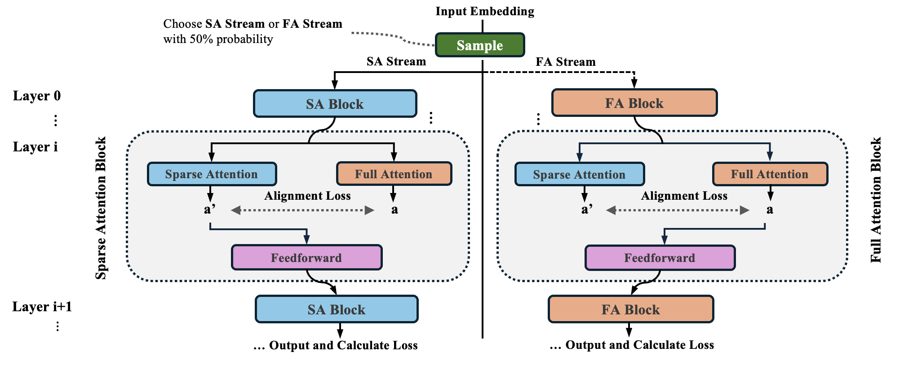

# SSA: Sparse Sparse Attention by Aligning Full and Sparse Attention Outputs in Feature Space

<p align="center">
  <a href="#installation">Installation</a> •
  <a href="#models">Models</a> •
  <a href="#training">Training</a> •
  <a href="#evaluation">Evaluation</a> •
  <a href="#citation">Citation</a>
</p>

# SSA: Sparse Sparse Attention

This is the official implementation of the paper: [SSA: Sparse Sparse Attention by Aligning Full and Sparse Attention Outputs in Feature Space](https://arxiv.org/abs/2511.20102).

## Overview

Sparse attention reduces the quadratic complexity of full self-attention but faces two fundamental challenges:

1. **Attention Gap**: Applying sparse attention to full-attention-trained models causes performance degradation due to train-inference distribution mismatch
2. **Capability Gap**: Models trained purely with sparse attention lack complete gradient flow, preventing them from matching full-attention performance

We propose **SSA (Sparse Sparse Attention)**, a training framework that integrates both sparse and full attention with bidirectional attention-output alignment to address both gaps simultaneously. We prove that the approximation error between sparse and full attention scales linearly with the dropped attention mass—motivating SSA's alignment objective, which explicitly promotes sparser attention distributions to further tighten this error bound.

<p align="center">
  
</p>

### Key Results

- 🎯 **Highest attention sparsity** among all methods, surpassing both Full-Full and Sparse-Sparse baselines
- 🚀 **State-of-the-art performance** under both sparse and full attention inference modes
- 🔄 **Flexible inference** - smoothly adapts to varying sparsity budgets without retraining
- 📚 **Superior long-context capabilities** with strong performance on LongBench and Needle-in-a-Haystack

### How SSA Works

At each training step, SSA randomly selects one of two attention modes with equal probability:

- **Sparse Attention Stream**: Directly optimizes for sparse inference, eliminating the train-inference distribution mismatch (addresses the *Attention Gap*)
- **Full Attention Stream**: Provides complete gradient flow to all tokens, serving as a reference that enables attention sparsity to explicitly bound the approximation error (addresses the *Capability Gap*)

Furthermore, SSA computes the counterpart attention at each layer to perform **bidirectional alignment**:
- Full-attention outputs are encouraged to match sparse-attention outputs → promotes inherently sparser distributions
- Sparse-attention outputs are regularized toward full-attention outputs → prevents drift from full-attention behavior

This design enables SSA to achieve substantially higher attention sparsity than baselines, translating into strong performance under both inference modes.


## Installation

### Requirements

- Python 3.10.12
- PyTorch 2.6.0
- CUDA 12.4
- FlashAttention 2.7.3

### Setup

```bash
# Clone the repository
git clone https://github.com/zhenyi4/ssa.git
cd ssa

# Install PyTorch
pip install torch==2.6.0 torchvision==0.21.0

# Install Flash Attention (download the appropriate wheel for your system)
pip install ~/flash_attn-2.7.3+cu12torch2.6cxx11abiFALSE-cp310-cp310-linux_x86_64.whl # download the wheel to local

# Install transformers and related packages
pip install "transformers==4.54.0" "tokenizers==0.21" "datasets==3.3" "peft==0.12.0"

# Install flash-linear-attention
git clone https://github.com/fla-org/flash-linear-attention.git
pip install ./flash-linear-attention

# Install native-sparse-attention
git clone https://github.com/fla-org/native-sparse-attention.git
pip install -v ./native-sparse-attention

# Install training dependencies
pip install typing-extensions==4.11.0
pip install deepspeed==0.18.0 accelerate==1.10.1
pip install liger-kernel==0.6.2

pip install typing-extensions==4.11.0
pip install deepspeed==0.18.0 accelerate==1.10.1
pip install liger-kernel==0.6.2
```

We minimally modify the NSA's algorithm to adapt SSA and MoBA:
```
py_path=/root/miniconda3/envs/ssa/lib/python3.10/site-packages # or something similar
cp hf_files/parallel.py  ${py_path}/native_sparse_attention/ops/parallel.py
```

## Models

### Pre-trained Model Checkpoints

We provide four 1B models pretrained on the 100B SmolLM dataset:

| Model | Description | Download |
|-------|-------------|----------|
| SSA-1B | SSA (Sparse-Sparse Attention) | [HuggingFace](https://huggingface.co/zen-E/SSA-1B) |
| FullAttn-1B | Full Attention baseline | [HuggingFace](https://huggingface.co/zen-E/FullAttn-1B) |
| MoBA-1B | MoBA baseline | [HuggingFace](https://huggingface.co/zen-E/MoBA-1B) |
| NSA-1B | NSA baseline | [HuggingFace](https://huggingface.co/zen-E/NSA-1B) |

### Model Configuration

SSA models use a custom LLaMA-NSA architecture with the following key configurations:

```json
{
  "model_type": "llama-nsa",
  "block_size": 16,
  "block_counts": 16,
  "window_size": 0, # adapted from NSA's sliding window
  "inference_mode": "sparse"
}
```

## Training

### Data Preparation

SSA uses a packing strategy for efficient pre-training. Data should be pre-tokenized by running:

```bash
python caching_hf.py \
    --model_name_or_path "meta-llama/Llama-3.2-1B" \
    --dataset_name "EleutherAI/SmolLM2-135M-100B" \
    --dataset_config "default" \
    --text_field "text" \
    --cache_dir "your_address/smollm_cache" \
    --streaming \
    --preprocessing_num_workers 8
```

### Training Script

Configure your training by editing `train_pt.sh`:

```bash
# Key configurations
MAXLEN=8192                    # Maximum sequence length
PER_GPU_BATCH=24               # Per-GPU batch size
GRA_ACC=2                      # Gradient accumulation steps -- we use 8 GPU for a grad_accum of 2
LR=1e-3                        # Learning rate
EPOCH=1                        # Number of epochs

# Paths (modify these for your setup)
root=your_address/ssa              # Project root directory
model=your_address/ssa/configs/ssa-1b-init  # Initial model path
data_cache=your_address/smollm_cache   # Pre-tokenized data path
```

Launch training:

```bash
# Single-node multi-GPU training
bash ssa/train_pt.sh
```

## Evaluation

Install lm-eval.

```
cd ssa
git clone https://github.com/EleutherAI/lm-evaluation-harness.git
cd lm-evaluation-harness
git checkout tags/v0.4.9 -b v0.4.9
pip install -e .
pip install "lm_eval[longbench]"
pip install "lm_eval[ruler]"
cd ../evaluation/
python fix_longbench_config.py  # greedy decoding and prompt fix
```

**Note:** In `lm-evaluation-harness/lm_eval/models/huggingface.py`, manually delete the line with `use_cache=True`. Sparse attention does not yet support `use_cache=True`.

### Configuring Sparse Attention

You can customize the following parameters for sparse attention evaluation:
- `inference_mode`: `sparse` or `full`
- `block_count`: number of sparse blocks
- `block_size`: size of each block

Pass these directly via lm-eval command line:

```bash
lm_eval --model hf \
    --model_args pretrained=your_model_path,trust_remote_code=True,my_custom_param="your_configuration" \
    --tasks hellaswag
```

### Perplexity Evaluation

```bash
cd evaluation
bash eval_ppl.sh
```
### Commonsense Reasoning

```bash
bash eval_benchmarks.sh
```

### Long-Context Benchmarks

For long-context evaluation of models pre-trained on 8k data, we use the following config for length extrapolation to 32k:

```json
"rope_scaling": {
  "factor": 4.0,
  "high_freq_factor": 4.0,
  "low_freq_factor": 1.0,
  "original_max_position_embeddings": 8192,
  "rope_type": "llama3"
}
```

```bash
# LongBench evaluation
# We can add the RoPE scaling config in the command line
bash eval_longbench.sh

# Needle-in-a-Haystack evaluation
# We have to add the RoPE scaling config in config.py because niah does not support dict type in model_args.
bash eval_niah.sh
```


## Citation

If you find SSA useful in your research, please cite:

```bibtex
@misc{shen2025ssasparsesparseattention,
      title={SSA: Sparse Sparse Attention by Aligning Full and Sparse Attention Outputs in Feature Space}, 
      author={Zhenyi Shen and Junru Lu and Lin Gui and Jiazheng Li and Yulan He and Di Yin and Xing Sun},
      year={2025},
      eprint={2511.20102},
      archivePrefix={arXiv},
      primaryClass={cs.CL},
      url={https://arxiv.org/abs/2511.20102}, 
}
```

## Acknowledgements

This project builds upon several excellent open-source projects:

- [Flash Attention](https://github.com/Dao-AILab/flash-attention)
- [Native Sparse Attention](https://github.com/fla-org/native-sparse-attention)
- [Flash Linear Attention](https://github.com/fla-org/flash-linear-attention)
- [Liger Kernel](https://github.com/linkedin/Liger-Kernel)
- [DeepSpeed](https://github.com/microsoft/DeepSpeed)

## License

This project is released under the [MIT License](LICENSE.txt).

